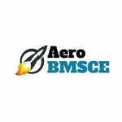

# AEROBMSCE

A modern, interactive website for the Aerospace Engineering Department/Club at BMS College of Engineering.

## 🚀 About

AEROBMSCE is a React-based web application designed to showcase aerospace engineering activities, projects, events, and team information. The application features a sleek, responsive design with both day and night modes, interactive animations, and engaging content layouts.

## ✨ Features

- **Interactive UI**: Smooth animations powered by Framer Motion
- **3D Elements**: Three.js integration for immersive aerospace-themed 3D components
- **Day/Night Mode**: Toggle between light and dark themes
- **Responsive Design**: Fully optimized for all device sizes
- **Modern Stack**: Built with React 19, TypeScript, and Vite
- **Animation Effects**: GSAP animations for enhanced user experience
- **Interactive Starfield**: Dynamic canvas-based star animations
- **Team Showcase**: Animated cards displaying team members

## 🛠️ Tech Stack

- **Frontend Framework**: React 19
- **Language**: TypeScript
- **Build Tool**: Vite
- **Styling**: Tailwind CSS

  
